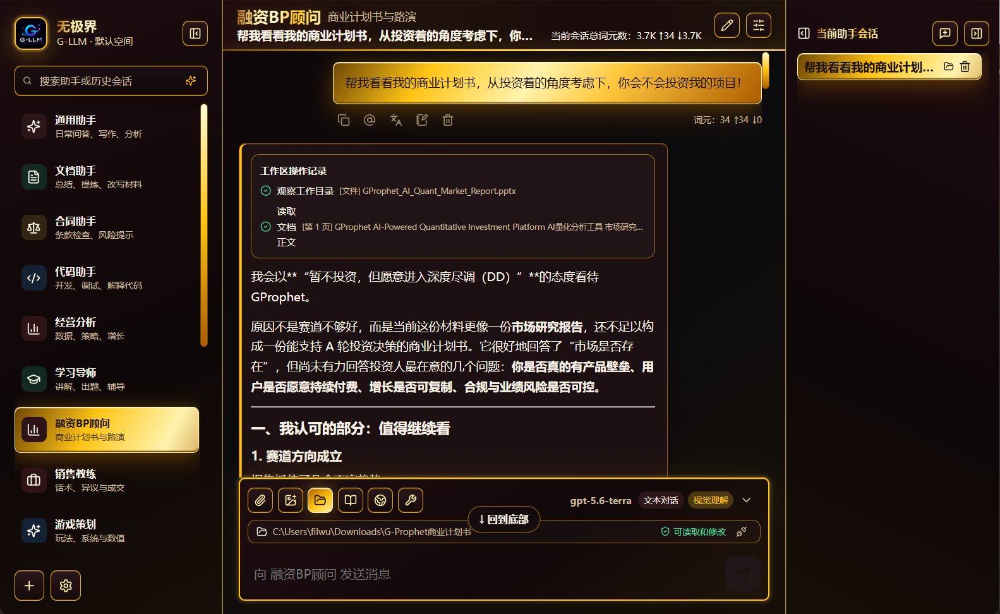
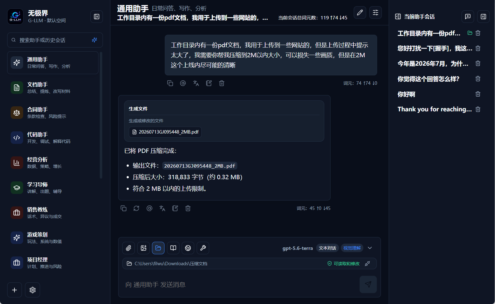
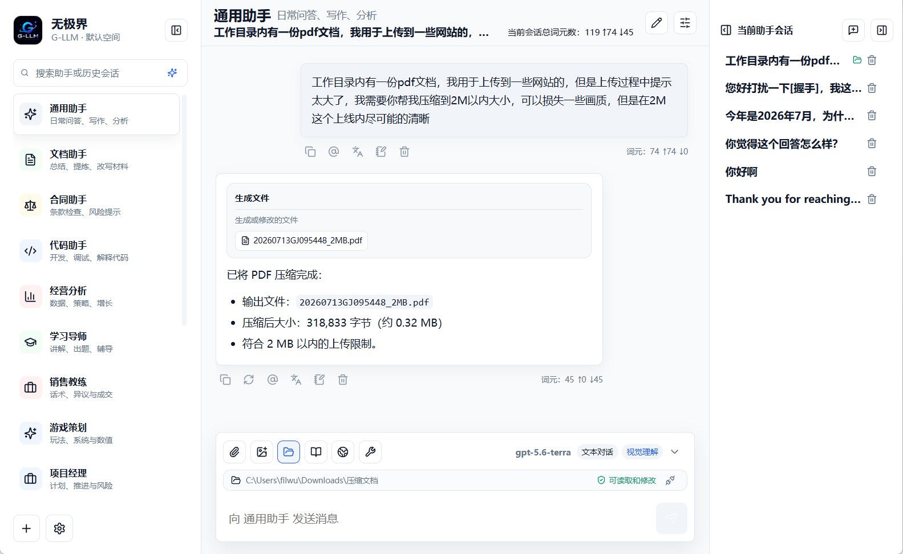

# 无极界 / G-LLM Client

[简体中文](./README.md) | [English](./README.en-US.md)

当前代码版本：[V1.2.2](https://github.com/filwu8/g-llm-client/tree/main)

最近稳定发布：[V1.2.2](https://github.com/filwu8/g-llm-client/releases/tag/v1.2.2)，发布于 2026-07-20。

> V1.1.0 起采用 BUSL-1.1，允许个人和企业免费内部使用；当前 V1.2.2 将于 2030-07-14 自动转换为 AGPL-3.0-only。V1.0.10 及以前版本继续适用其发布标签中的 AGPL-3.0-only。

[下载客户端](https://llm.gprophet.com/download) | [完整更新日志](https://llm.gprophet.com/download/changelog) | [GitHub Releases](https://github.com/filwu8/g-llm-client/releases)

G-LLM Client 是 GPROPHET LIMITED 自研的跨平台桌面 AI 客户端，支持 Windows、macOS 和 Linux。当前产品方向是“助手优先”：用户先选择或创建适合场景的助手，再在同一个桌面客户端里完成模型配置、知识引用、截图提问、文件理解和多轮对话。

## 界面预览

工作区 Agent 可以在用户授权的目录中读取和修改文件，并把操作过程直接呈现在会话里。符合条件的 G-LLM 付费用户还可启用专属金色主题。



本地文件处理支持在对话中生成、修改和压缩文件，界面提供亮色与暗色两种基础主题。

| 暗色主题 | 亮色主题 |
| --- | --- |
|  |  |

## V1.2.2 工作区智能体稳定性与授权体验更新

- 工作区请求改用流式响应：持续接收模型内容和工具调用，120 秒限制只在模型长时间没有任何新数据时触发，避免复杂文件任务在最终步骤被总时长误判为超时。
- 快速对话补齐工作区能力：可选择并显示当前文件夹、调用工作区工具、查看执行过程与结果，并与主窗口同步会话状态。
- 三级授权模式：提供“需要审批”“自动审批”“完全授权”，可在聊天窗口上方随时切换；应用内审批弹窗遵循当前主题并清楚说明操作目的和权限边界。
- 脚本执行兼容性增强：安全沙箱补充 Base64、Blob 和压缩流能力，支持更多文档与表格处理脚本，同时继续禁止网络、系统命令和工作区外访问。
- 错误提示更易理解：将缺少运行能力、表格单元格不存在等技术异常转换为普通用户可读的说明，便于判断是环境限制、文件结构变化还是脚本问题。

## 当前能力

- 跨平台桌面客户端：Electron + React + TypeScript，支持 Windows、macOS、Linux 打包。
- 助手工作流：内置通用、文档、合同、代码、经营分析、学习导师等助手，支持新建、编辑、拖动排序、置顶、隐藏、恢复和删除助手。
- 中英文界面：支持跟随系统或手动选择简体中文、English，并同步切换主窗口、快速对话和系统菜单。
- 多供应商与多模型：默认 G-LLM 网关，也支持 OpenAI-compatible、OpenAI、DeepSeek、本地兼容服务等供应商模板。
- 模型管理：支持测试供应商连接、拉取 `/models`、能力识别和默认模型选择。
- 统一模型选择：聊天、全局默认模型、助手设置和快速对话共享模型列表，支持能力标签与自然名称排序。
- 聊天体验：流式回复、开场问题、Markdown 渲染、会话历史和本地保存；消息显示完整日期、所选时区以及总/输入/输出 Token，主窗口与快速对话使用一致的信息布局。
- 智能历史搜索：支持用主题、人物、任务或结论等自然语言跨空间找回旧会话，并跳转到原始会话。
- 本地能力：轻量知识库、助手长期记忆、项目长期记忆、本地数据存储、数据导入导出。
- 附件与视觉输入：支持文件、图片、剪贴板粘贴、系统截图，并可将截图复制到系统剪贴板。
- 本地文件任务：可将本机图片或 PDF 压缩到指定字节限制，执行前展示计划与 PDF 有损重建提示，默认不覆盖源文件，并逐个验证输出结果。
- 会话工作区：可为单个会话授权本地目录，让当前模型在受控路径内查看、搜索、创建和修改文件，并显示工具执行时间线。
- 联网与工具：支持 Bing Search RSS 与 Google News RSS 联网检索、中文查询规划和来源去重，让搜索资料进入提问上下文。
- 三套主题：默认自动跟随系统亮色/暗色，也可手动选择；使用有效的官方 G-LLM API Key 时开放金色主题。
- 弹窗体验：全屏弹窗统一使用毛玻璃背景和渐进式入场动画，并支持系统“减少动态效果”偏好。
- 隐私友好的匿名统计：默认只上报匿名元数据，不采集聊天内容、API Key、文件内容、截图内容、知识库内容或记忆内容，用户可在设置中关闭。

## 桌面常驻体验

客户端提供以下桌面常驻体验：

- Windows 托盘、macOS 菜单栏和桌面宠物单击均打开快速对话；右键菜单可打开主窗口或执行其他完整操作。
- Windows 点击关闭按钮不会退出应用，而是隐藏到系统托盘。
- 最小化主窗口后显示桌面悬浮 G-LLM logo。
- 悬浮 logo 支持拖动，并会吸附到屏幕边缘。
- 悬浮 logo 右键菜单与托盘/菜单栏右键菜单复用同一套功能：打开快速对话、打开主窗口、显示/隐藏悬浮窗、退出 G-LLM。
- 快速对话窗口为透明无边框、置顶小窗，适合随时唤起。
- 快速对话与主窗口统一显示消息操作、完整时间、时区和 Token 用量。
- 截图按钮会先隐藏当前界面，再进入 Windows 截图流程。
- 应用启用单进程保护；重复双击快捷方式会唤起已有窗口，不再启动多个进程。
- 主进程日志写入 `%APPDATA%/G-LLM/logs/main.log`，便于定位用户机器上的闪退或启动问题。

> 说明：当前公开构建如果未配置 Windows 代码签名证书，可能被 Smart App Control 或杀毒软件提示风险。可信签名、Microsoft Store/MSIX 分发属于发布合规工作，正在单独推进。

## Development

```bash
pnpm install
pnpm dev
```

如果本机没有全局 Node.js，可以使用 Codex 工作区自带运行时：

```powershell
$env:Path='C:\Users\filwu\.cache\codex-runtimes\codex-primary-runtime\dependencies\node\bin;C:\Users\filwu\.cache\codex-runtimes\codex-primary-runtime\dependencies\bin;' + $env:Path
pnpm dev
```

## Build

```bash
pnpm build
pnpm package:win
pnpm package:mac
pnpm package:linux
```

构建产物输出到 `dist/`。GitHub Actions 会分别在 Windows、macOS、Linux runner 上构建对应平台产物。

## API Contract

当前客户端按 OpenAI Chat Completions 流式协议调用：

```http
POST {apiBaseUrl}/chat/completions
Authorization: Bearer {apiKey}
Content-Type: application/json
```

请求体包含：

```json
{
  "model": "g-llm-chat",
  "messages": [],
  "temperature": 0.7,
  "max_tokens": 4096,
  "stream": true
}
```

首次使用会打开供应商设置。默认供应商为 G-LLM：

```text
https://llm.gprophet.com/v1
```

用户填写自己的 API Key 后即可请求真实网关。也可以从供应商模板新增其他 OpenAI-compatible 配置，再切换为当前供应商。

供应商设置中的“拉取模型”会调用：

```http
GET {apiBaseUrl}/models
Authorization: Bearer {apiKey}
```

兼容标准 OpenAI `/models` 返回格式，也兼容简单字符串数组。

## Release QA

发布前请参考 [docs/release-qa-checklist.md](./docs/release-qa-checklist.md) 完成三端基础验证，尤其是 Windows 托盘、悬浮 logo、截图、单进程保护和启动日志。

## License

G-LLM Desktop Client 由 GPROPHET LIMITED 发布。当前开发版本 V1.2.2 采用 [Business Source License 1.1](./LICENSE)，并附带额外使用授权。

个人使用、学习研究、测试评估和企业内部业务使用免费。未经 GPROPHET LIMITED 书面商业授权，不得白标或 OEM、转售或出租、作为竞品发布或分发，也不得向第三方提供托管、代运营、外包或应用服务。

V1.2.2 将于 2030-07-14 自动转换为 AGPL-3.0-only。V1.0.10 及以前版本不受本次变更影响，继续适用各自发布标签中已经附带的许可证。

完整许可边界见 [LICENSE](./LICENSE) 和 [LICENSE_POLICY.md](./LICENSE_POLICY.md)，商业授权说明见 [COMMERCIAL_LICENSE.md](./COMMERCIAL_LICENSE.md)，贡献代码前请阅读 [CONTRIBUTING.md](./CONTRIBUTING.md)。

商业授权、OEM 合作、企业部署、白标授权请联系：

```text
GPROPHET LIMITED
Email: licensing@gprophet.com
Website: https://llm.gprophet.com/
```

源码许可证不自动授权使用 "G-LLM"、"WujiJie"、"无极界" 及相关 Logo、图标、宣传语或品牌资产。品牌和商标使用规则见 [TRADEMARKS.md](./TRADEMARKS.md)，第三方组件许可证见 [THIRD_PARTY_NOTICES.md](./THIRD_PARTY_NOTICES.md)。
